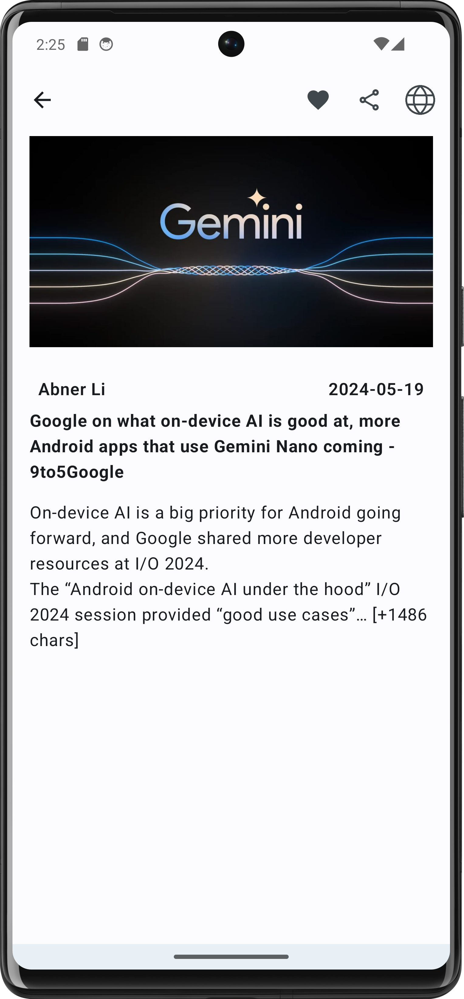
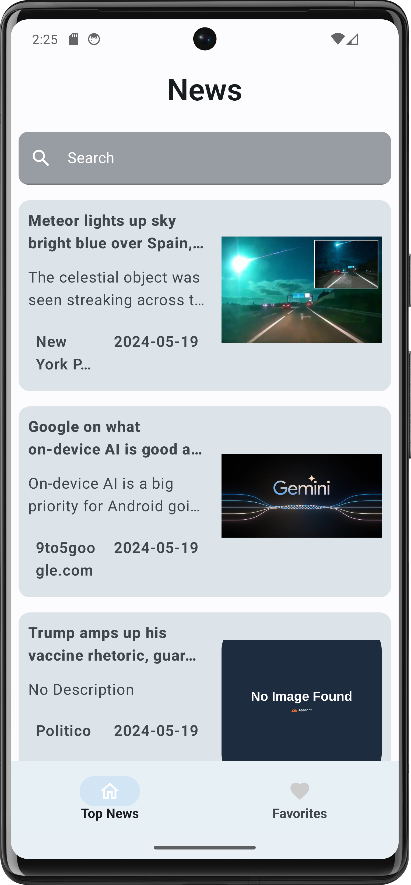
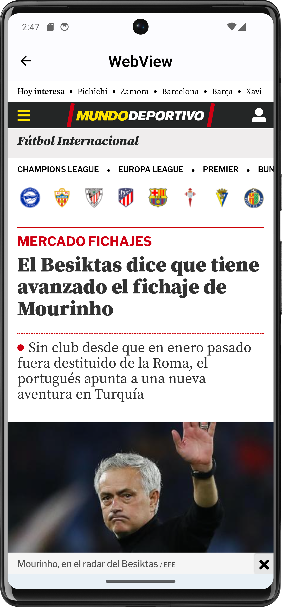
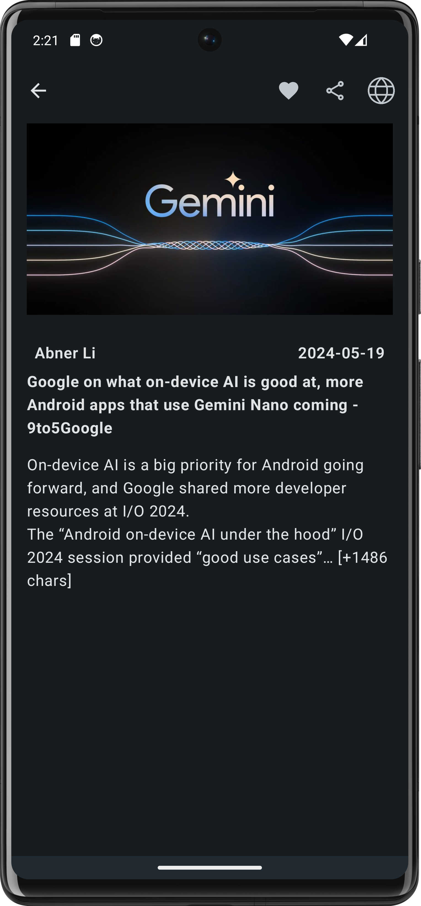
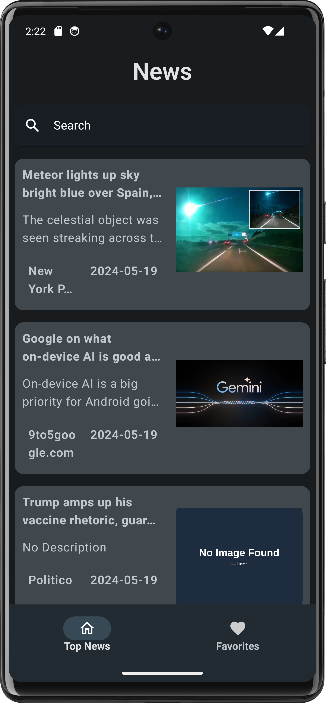
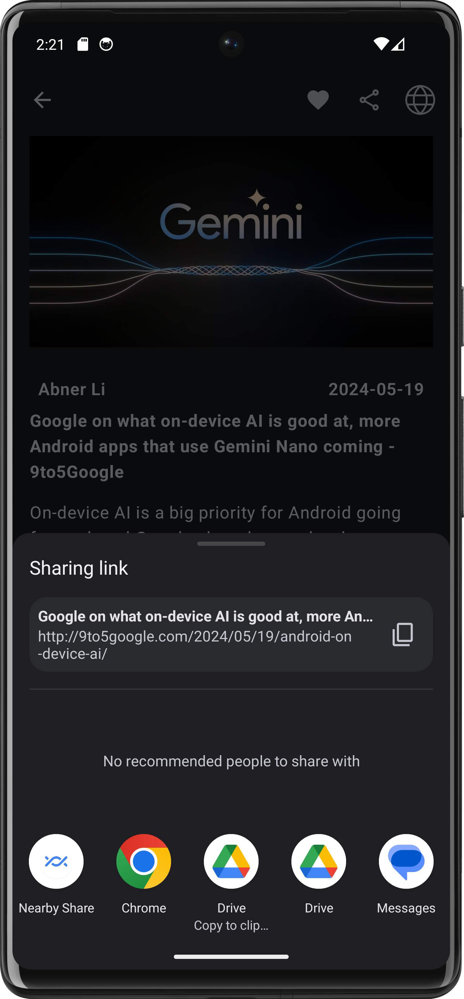
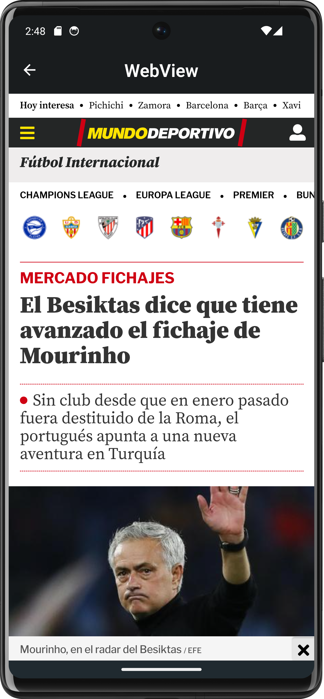

# NewsApp
- This mobile  application is developed as an internship application for Appcent company.

## Built With 🛠
- [Jetpack Compose](https://developer.android.com/jetpack/compose) : It is a method that allows you to create easily customisable user interfaces
- [Coroutines](https://kotlinlang.org/docs/reference/coroutines-overview.html) :  For asynchronous operations
- [Flow](https://kotlin.github.io/kotlinx.coroutines/kotlinx-coroutines-core/kotlinx.coroutines.flow/-flow/) : Cold asynchronous data stream
- [OkHttp and Retrofit](https://square.github.io/retrofit/) : Type-safe HTTP client for Android
- [Hilt Dagger](https://developer.android.com/training/dependency-injection/hilt-android?hl=en) : Static dependency injection
- [Coil](https://coil-kt.github.io/coil/compose/) : A fast library to show images more efficiently
- [MVVM](https://developer.android.com/codelabs/basic-android-kotlin-compose-viewmodel-and-state) : Model-View-Viewmodel architecture
- Room DB: Soon..

## Light Theme
|                   0000                    |                   0001                   |                   0010                   |                       0011                        |
|:-----------------------------------------:|:----------------------------------------:|:----------------------------------------:|:-------------------------------------------------:|
|  |  |  |  |

## Dark Theme
|                      0000                       |                     0001                     |                  0010                  |                       0011                       |
|:-----------------------------------------------:|:--------------------------------------------:|:--------------------------------------:|:------------------------------------------------:|
|  |  |  |  |
